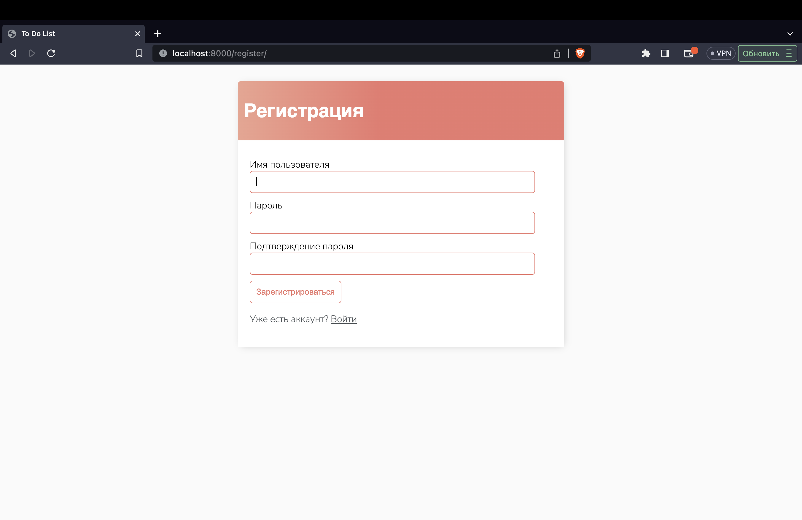

# Django To Do List
В оригинальном проекте 12 коммитов, но я забыл добавить Secret key в .env и поэтому пришлось перезалить репозиторий.

При помощи Django было создано веб приложение, в котором можно добавлять различные задачи, а также редактировать их и удалять.

Для добавления уникальных задач есть возможность зарегистрировать пользователя и в дальнейшем использовать его.

Также была стилизована админ-панель

